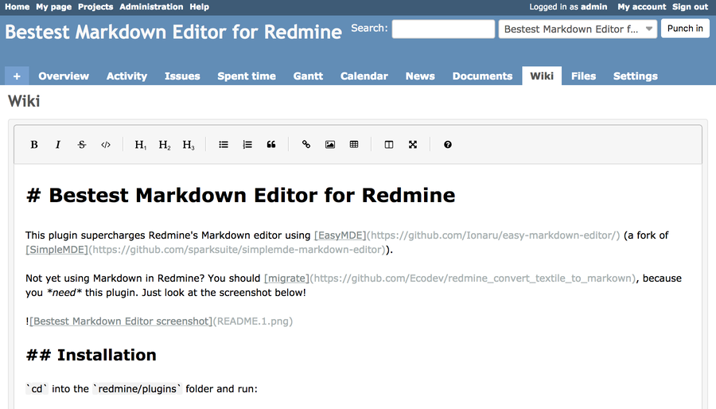

# Bestest Markdown Editor for Redmine

This plugin supercharges Redmine's Markdown editor using [EasyMDE](https://github.com/Ionaru/easy-markdown-editor/) (a fork of [SimpleMDE](https://github.com/sparksuite/simplemde-markdown-editor)).

Not yet using Markdown in Redmine? You should [migrate](https://github.com/Ecodev/redmine_convert_textile_to_markown), because you *need* this plugin. Just look at the screenshot below!



## Installation

`cd` into the `redmine/plugins` folder and run:

```bash
git clone https://github.com/LeviticusMB/bestest_markdown_editor.git
```

## Upgrade to latest stable release

`cd` into the `redmine/plugins` folder and run:

```bash
git pull
```

## Branches/major releases

### `master`

The `master` branch tracks the latest stable release.

### `v1.1` (2018-07-29)

* Support for syntax highlighting in code blocks.
* Enabled the inline preview button in the toolbar.
* Bundle Font Awesome so we don't depend on the internets.

### `v1.0` (2018-07-22)

* Initial release branch.
